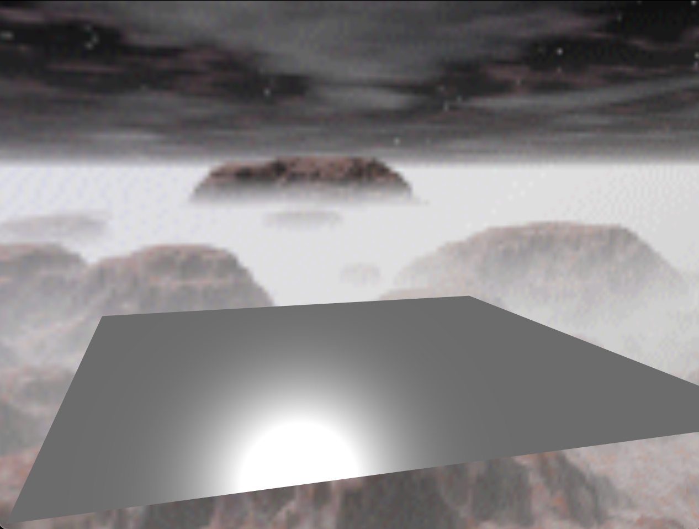
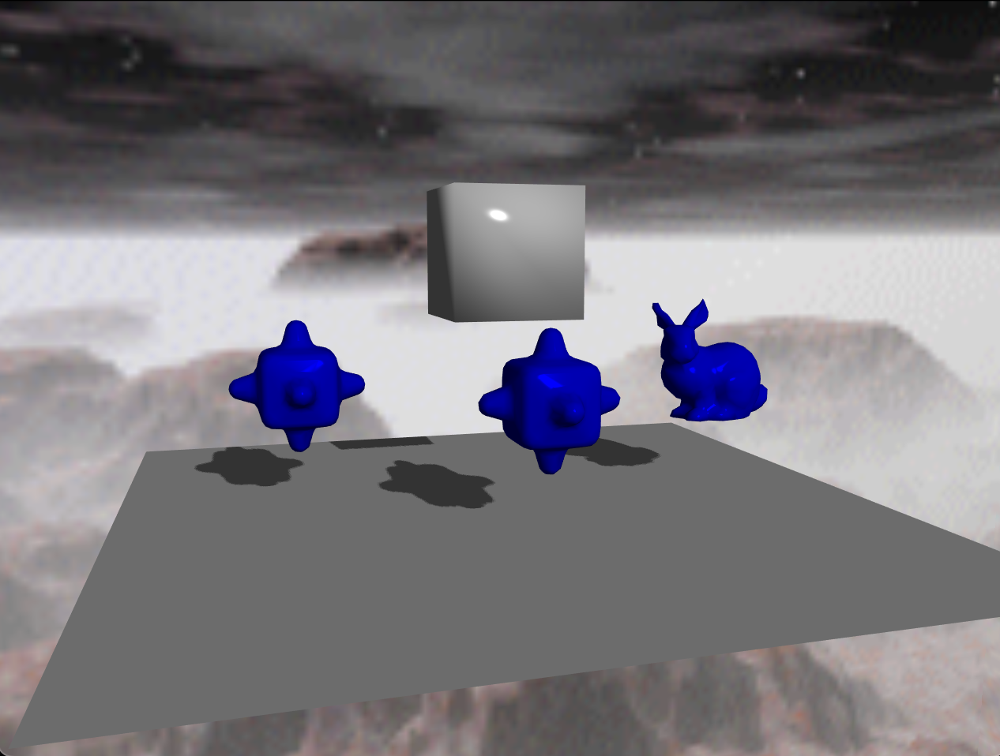
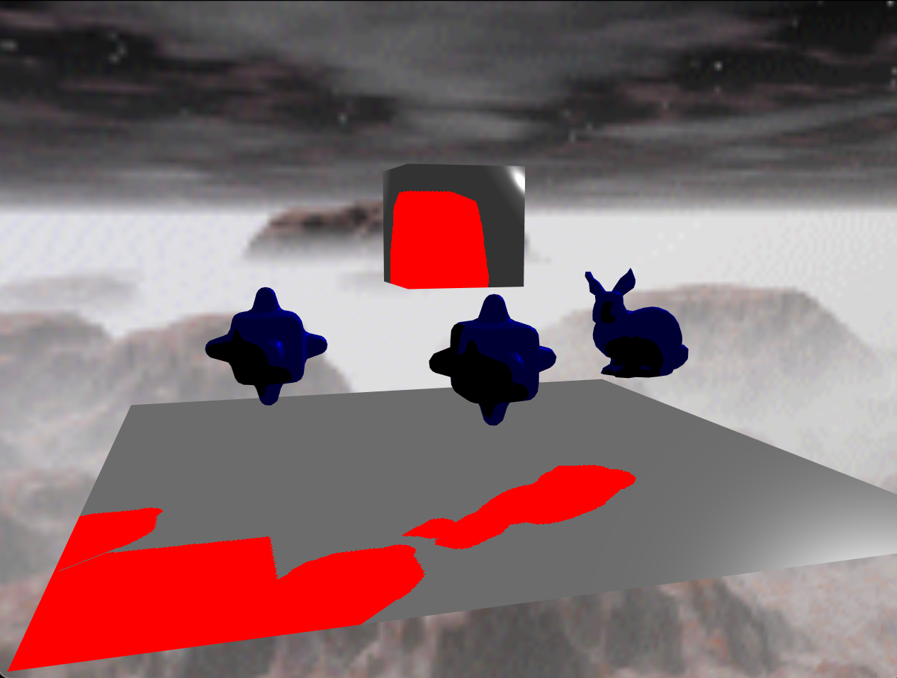
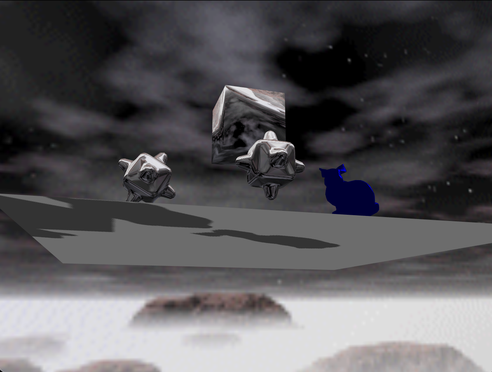

## Assignment 4 Environment & Shadow Mapping
### Ye Xu

So for this project, build beyond previous code the key is to make shadow mapping and environment mapping possible. 
Here as the first image displayed. It rendered a skybox(cubemapping) as the grand environment. Here
the picture I used in my opinion is upside down, thus for cubemapping stbi invert is implemented to flip it 
back.    

This second image is simply generate multiple object. For cubic I did applied a different object color 
for the benefit of seeing red shadow effect on object with different color. As an upgrade from previous assignment.  
This time a 3D object class is implemented to store each 3D object individually instead of putting everything 
into a few VBO to render selectively. Each object has its own model data for easier and selective rendering.  
Below is the image with multi object some are from same class to have its own position. As shadow is also toggled.  

  

This is red shadow toggled, as on blue color object is not significant due to color mix, but on the white 
cube is perfectly clear.  

  

Finally the environment mapping is strictly using learn openGL as a tutorial. As here instead of reflection, I did 
follow the tutorial to create a refraction mapping instead, as when looking from below you can see through object with sky 
behind it. As texture data is putting in shader. Real time calculation is made so that even after rotation the new 
environment mapping result will be calculated. 

